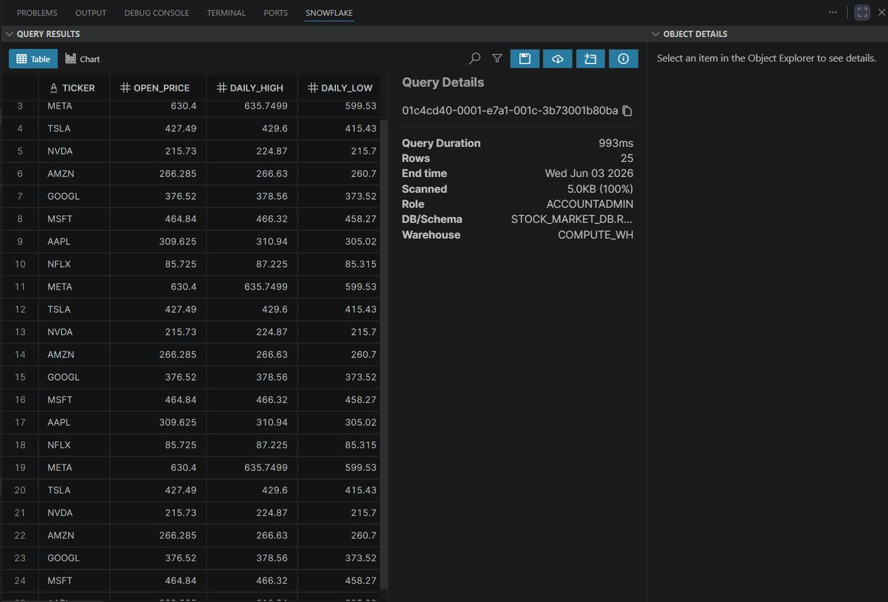
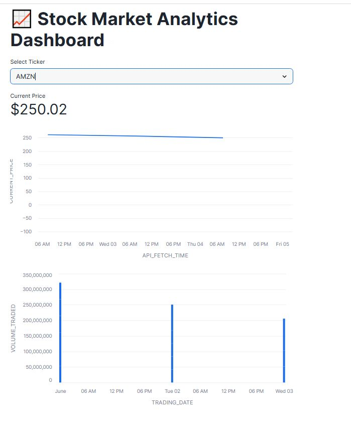

# 📈 Live Stock Market Data Pipeline & Dashboard

An end-to-end, near-real-time data engineering pipeline that extracts live financial data from a third-party Stock API, stages the raw payloads in Amazon S3, automatically ingests them into Snowflake using event-driven Snowpipe, and visualizes the results via an embedded Snowflake Streamlit application.

---

## 🏗️ Architecture Overview

The pipeline automates the transition of streaming API data into an analytics-ready dashboard using a modern, cloud-native stack:

1. **Data Ingestion (Python):** A script polls the Stock API, extracts real-time financial metrics, and writes unique, timestamped JSON payloads into an Amazon S3 bucket.
2. **Data Lake Storage (AWS S3):** Acts as the landing zone for raw, immutable JSON data structures.
3. **Event Notification (S3 to SQS):** An S3 event trigger listens for `s3:ObjectCreated:*` events and instantly forwards notification payloads to Snowflake's SQS queue.
4. **Continuous Ingestion (Snowflake Snowpipe):** Snowpipe consumes the SQS queue messages and automatically runs a targeted `COPY INTO` command to load incoming files into a Bronze staging table.
5. **Analytics & Visualization (Streamlit in Snowflake):** A native Python Streamlit app directly queries the active Snowflake schema to provide live price visuals and data audits.

---

## 🛠️ Tech Stack
* **Language:** Python 3.x
* **Cloud Infrastructure:** AWS (S3, IAM)
* **Data Warehouse:** Snowflake
* **Ingestion Engine:** Snowpipe (Auto-Ingest via SQS)
* **Dashboard Layer:** Streamlit (Native Snowflake App)

---

## 🚀 Getting Started & Configuration

### 1. Python Script Setup
The extraction script connects to the target API and creates uniquely named files to ensure Snowpipe processes every individual event stream without file-name collision issues.

* **Dependencies:** `pip install requests boto3 dotenv`
* Configure your `.env` file with your API credentials and AWS IAM keys before executing the script:
  ```bash
  python datamaker.py

### 2. Snowflake Setup
execute every sql file in oredr.

⚠️ Crucial AWS S3 Linkage: Run SHOW PIPES LIKE 'stock_snowpipe'; in Snowflake and copy the ARN string from the notification_channel column. Paste this ARN into your AWS S3 Bucket ➔ Properties ➔ Event Notifications tool targeted at all object creation events.


### 3. Deploying the Streamlit Dashboard
Navigate to the Projects ➔ Streamlit tab inside your Snowflake account console, spin up a new application and run the streamlite.py inside the snowflake and deploy it.


